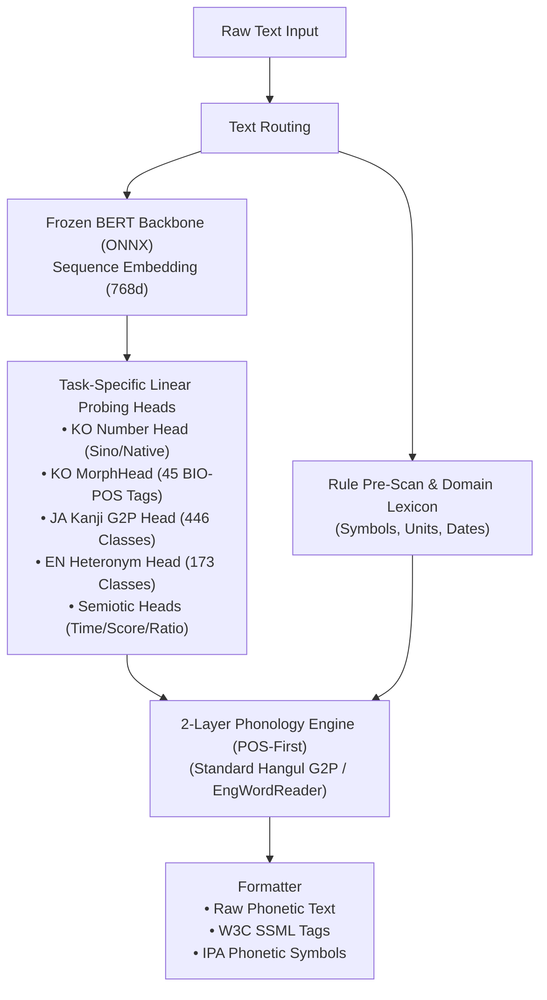

# SNAP (Semantic Normalization via Attached Probes) Technical White Paper

> **실시간 스트리밍 환경을 위한 문맥 인지형 다국어 TTS 전처리 엔진**  
> *경량 ONNX BERT Probing Head와 결정론적 언어학 규칙을 결합한 하이브리드 프론트엔드*

**저자**: 이재혁 (Jaihyuk Lee, [snap.leejh@gmail.com](mailto:snap.leejh@gmail.com))  
**발행일**: 2026년 8월 | **버전**: 1.0.0

[English](SNAP_White_Paper_v1.0.md) | [한국어](SNAP_White_Paper_v1.0_KO.md)  
[공식 웹사이트](https://snap-libs.github.io/snap/) | [텍스트 전처리 데모](https://huggingface.co/spaces/softguy777/snap-demo) | [MeloTTS 데모](https://huggingface.co/spaces/softguy777/snap_voice_demo) | [Piper 데모](https://huggingface.co/spaces/softguy777/snap_voice_demo2) | [F5-TTS 데모](https://huggingface.co/spaces/softguy777/snap_voice_demo3)

> 🚀 **최신 버전 안내**: 최신 대규모 벤치마크 및 상용 엔진 사양은 **[SNAP 한국어 v2.0 기술 백서](SNAP_White_Paper_v2.0_KO.md)** ([English](SNAP_White_Paper_v2.0.md))에서 확인하실 수 있습니다. 본 문서는 Pure Context Probing 원천 기술 연구 백서(v1.0)입니다.

---

## 1. 개요 : 왜 SNAP이 필요한가?

### ① TTS 파이프라인의 오류 전파 (Cascading Error Propagation)
음성합성(TTS) 시스템은 일반적으로 **텍스트 정규화(TN) → 음운 변환(G2P) → 음향 모델(Acoustic Model) → 보코더(Vocoder)**의 순차 파이프라인 구조를 따릅니다.  
이 구조에서 프론트엔드(TN/G2P) 단계의 오독이나 비표준 발음 변환은 다운스트림 음향 모델로 그대로 전파되며, 이후 단계에서 이를 자체적으로 보정할 수 없습니다. 따라서 텍스트 전처리 단계의 정확도는 최종 합성 음성의 명료도와 직결됩니다.

### ② 기존 전처리 방식의 구조적 한계와 트레이드오프
* **1. 규칙 및 FST(유한상태변환기) 기반 방식 (g2pK, Thrax, espeak-ng 등)**:
  * 형태 변화가 고정된 일반 표준 어휘나 정형화된 패턴을 **적은 연산량과 빠른 속도로 안정적이게 처리**하며, 동작이 결정론적이어서 관리가 용이합니다.
  * 하지만 표면 문자열 규칙에 의존하기 때문에, **주변 문맥(Context)이나 어휘의 의미 차이에 의해 발음이 갈리는 어휘에는 반응하기 어렵습니다.**
  * 예: `"3번 버스"` [삼 번] vs `"3번 반복"` [세 번] (식별 번호 vs 횟수)
  * 예: `"3:10에 출발"` [세 시 십 분] vs `"경기 결과 3:10"` [삼 대 십] (시간 vs 점수)
  * 예: `"소송의 대가(代價)"` [대까] vs `"바둑의 대가(大家)"` [대가] (동철이음이의어)
  * 이러한 문맥성 예외를 규칙으로만 처리하려면 극도로 복잡한 다단계 조건문이 필요하며, 문장의 전체 맥락이나 의미 관계에 의존하는 경우에는 규칙 기반만으로 해결하는 것 자체가 불가능합니다.
* **2. 신경망 Seq2Seq / 번역 모델 기반 방식 (RNN, Transformer-TN 등)**:
  * 텍스트를 입력받아 정규화된 텍스트/발음열을 직접 '생성(Generation)'하는 방식으로 문맥 인지력은 향상되었습니다.
  * 하지만 생성형 모델 특유의 **환각(Hallucination) 및 단어 누락·임의 치환 오류**가 발생할 위험이 있어, 한 글자의 오독도 치명적인 음성합성 시스템에서 안정성이 떨어집니다.
* **3. 대형 언어모델(LLM) 기반 방식 (Few-Shot / Instruction Tuning)**:
  * 문맥 이해도는 가장 우수하지만, 수억~수십억 개 파라미터로 인한 **높은 연산 비용과 수백 ms 이상의 지연 시간(Latency)**이 발생합니다.
  * 실시간 스트리밍 음성합성, AICC(AI 콜센터), 온디바이스(On-device) 등 빠른 응답 속도가 필수적인 환경에는 적용하기 어렵습니다.

> **💡 실제 산업 현장의 병목: 완전 자동화의 부재와 수작업 검수**  
> 이러한 한계로 인해 현재 오디오북, 방송 더빙, AICC 등 실무 제작 환경에서는 TTS 텍스트 전처리를 완전히 자동화하지 못하고 있습니다. 작업자가 사전에 대본을 전수 검수하여 오독이 예상되는 단어를 소리 나는 한글로 직접 고쳐 쓰거나(Manual Overriding), 수작업으로 단어 사전을 등록하고 SSML 태그를 일일이 달아주는 **'휴먼 인 더 루프(Human-in-the-loop)' 작업이 필수적인 비용과 시간 병목**으로 작용하고 있습니다. 특히 사람이 사전에 검수할 수 없는 **'실시간 생성형 AI 대화(LLM-to-Speech)' 환경에서는 이러한 전처리 오류가 여과 없이 노출**되는 문제가 발생합니다.

### ③ SNAP의 해결 접근법
SNAP은 **"신경망의 문맥·의미 정보 추출"과 "결정론적 규칙·사전의 안전한 최종 제어"**를 결합한 하이브리드 구조로 위 한계들을 극복합니다.

* **신경망은 '문맥 정보 제공자' (Span-Level Probing Head)**:
  * 신경망이 텍스트를 직접 한글로 바꾸거나 생성(Generation)하지 않습니다.
  * 동결된 소형 BERT(Frozen BERT) 백본 위의 경량 Probing Head가 **문맥 의존적인 어휘·수사·기호의 의미적 속성(Span Tag/품사)만 극히 적은 연산 오버헤드로 판별하여 룰 엔진에 전달**합니다.
* **룰 엔진이 '최종 발음 판별 및 변환' (100% Deterministic Rule Engine)**:
  * 신경망이 제공한 문맥 정보를 바탕으로, **실제 텍스트 치환과 한국어 표준 발음법(연음, 자음동화 등) 적용은 검증된 룰/사전 엔진이 100% 안전하게 판별·수행**합니다.
  * 따라서 신경망 특유의 단어 왜곡이나 환각(Hallucination)이 원천 차단되며, 예외 발생 시 사전 등록으로 즉각 수정할 수 있습니다.
* **단독 구동 모드 (Standalone Mode)**: 약 120MB의 가벼운 메모리 점유율과 실시간 스트리밍에 최적화된 저지연 처리 속도(수십 ms 이내)로 일반적인 독립 TTS 파이프라인에 연동됩니다.
* **BERT 내장형 TTS 연동 시 이점 (Embedded Mode, 특수 케이스)**: MeloTTS, BERT-VITS2처럼 음향 모델 자체가 운율 예측을 위해 이미 내부에서 BERT를 구동하는 아키텍처 군의 경우, 해당 모델의 계산된 BERT Hidden States를 공유·재사용함으로써 전처리로 인한 추가 연산 오버헤드를 거의 발생시키지 않고(Near-Zero) 처리할 수 있습니다.

---

## 2. SNAP이 해결하는 일 (주요 기능과 가치)

SNAP은 입력된 원문 텍스트를 사람이 실제 발음하는 표준 음운 형태와 자연스러운 낭독 호흡으로 변환하여, **사람의 사전 대본 검수 없이도 신뢰성 있는 음성합성이 가능하도록 지원**합니다.

---

### 1) 문맥에 따른 정확한 한국어 표준 발음 및 조사·어간 구분
* **한국어 표준 발음법 전수 지원**:
  * 국립국어원 표준 발음법(제1항~제30항)에 명시된 자음동화(비음화/유음화), 구개음화, 격음화, 된소리되기(경음화), 연음 규칙, 음절의 끝소리(중화), `ㄺ/ㄼ` 특례 발음, 자모 이름 치환(ㄱ → 기역) 등 복잡한 한국어 음운 변환을 누락 없이 적용합니다.
* **품사 및 문맥에 따른 발음 변별**:
  * 동일한 글자라도 접속조사 `'과'`(`[과]` 평음)와 학과 명사 어근(`[문과 → 문꽈, 이과 → 이꽈]` 된소리)을 문맥에 맞게 정확히 구분합니다.
  * 관형격 조사 `'의'`(`[에]` 발음)와 독립 명사 어간(`'의의', '정의', '회의'` 등 `[이]` 발음)을 분별하여 어색하지 않은 자연스러운 소리를 구현합니다.
* **실제 청취 관습을 반영한 외래어 현실 발음**:
  * 규범상 평음 표기라도 `버스` [뻐스], `서비스` [써비스], `시스템` [씨스템], `골` [꼴] 등 실제 일상 구어에서 자연스럽게 통용되는 현실 발음을 반영하여 청각적 이질감을 해소합니다.

---

### 2) 영단어 및 전문 약어의 자연스러운 한글 발음화
* **문장 내 영단어·외래어 자동 발음 변환**:
  * 텍스트 중간에 섞여 나오는 영단어, IT/비즈니스 전문 용어, 브랜드명을 문맥에 맞는 한글 발음으로 자동 치환합니다.
* **사전에 등록되지 않은 미등록 영단어(OOV) 자동 낭독**:
  * 사전에 없는 신생 영단어나 약어 결합 복합어가 나오더라도 음절 구조와 복합어 패턴을 자체 분석하여, 엉뚱하게 뭉개지 않고 사람이 읽는 방식 그대로 자연스러운 한글 소리로 생성합니다.  
    *(예: `AAAtechnology` [에이에이에이테크놀로지], `CloudNative` [클라우드네이티브], `LlamaIndex` [라마인덱스])*
* **N-gram 문맥 스캔 기반의 복합 제품 모델명 낭독**:
  * 전후 단어 패턴(N-gram)을 스캔하여 제품명 뒤의 숫자가 단순 수량이 아닌 모델 번호임을 인식하고, 영문과 숫자를 실생활 관습에 맞게 정확히 발음합니다.  
    *(예: `iPhone 16 Pro` [아이폰 십육 프로], `Galaxy S24+` [갤럭시 에스이십사 플러스], `MacBookPro` [맥북프로], `PS5` [파이브], `Windows 10` [텐])*
* **복수형 및 파생형 영단어 처리**:
  * 복수형(`~s`, `~es`)이나 부사형(`~ly`, `~ically`) 접미사가 결합된 영단어도 어색하지 않은 한국어 발음으로 매끄럽게 연결합니다.

---

### 3) 문맥에 맞는 숫자·단위 낭독 (고유어 vs 한자어 수사 판별)
* **동일 숫자의 문맥별 수사 체계 자동 분별**:
  * 동일한 표기의 숫자라도 뒤따르는 문맥에 따라 고유어 수사('한, 두, 세...')와 한자어 수사('일, 이, 삼...')를 정확히 가려 읽습니다.
  * 예: `"3번 버스"` **[삼 번]** (식별 번호) vs `"3번 반복"` **[세 번]** (횟수)
  * 예: `"20대 청년"` **[이십대]** (연령대) vs `"차 20대"` **[스무대]** (수량)
* **다양한 일상 단위명사 자동 매핑**:
  * 50여 종 이상의 고유어 단위(`개, 명, 살, 마리, 잔, 병, 채, 권, 캔, 팩` 등) 및 한자어 단위(`층, 호, 년, 월, 일, 원, kg, %` 등)를 사전 등록 없이도 자연스럽게 변환합니다.

---

### 4) 복합 기호, 수식, 서식(Form)의 구어체 변환
* **통화 및 물리/IT 단위**:
  * `$100` [백달러], `₩10,000` [만 원], `$1.5` [일쩜오달러] 등 통화 기호.
  * `kg, cm, %, GB, Mbps, ℃, kcal` 등 70여 종의 단위 및 유니코드 기호(`㎾h`, `㎎`, `㎞`, `㎖` 등)를 한글 단위명으로 변환.
* **날짜·시간·버전·연락처 서식**:
  * 날짜(`2026.8.23`, `8/17일`), 분수(`3/4` [사분의 삼]), 분기(`3/4분기` [삼사분기]), 버전 표기(`v1.0.0`, `ver 2.1`), 전화번호/IP 주소(`010-...`, `192.168.1.1`).
* **수식 및 기호 결합 복합어**:
  * 수학 연산자 (`+` 더하기, `-` 빼기, `×` 곱하기, `÷` 나누기, `=` 은/는 받침 판별).
  * 기호 결합 어휘 (`C++`, `GalaxyS24+`, `C#`, `R&D`, `A-`, `K-방역`).
* **비음성 장식 기호 및 괄호 주석 정제**:
  * 음성 낭독에 불필요한 장식용 특수문자(`★`, `※`, `☎` 등)와 괄호 주석을 자동으로 정제하여 매끄러운 읽기 텍스트로 정리합니다.

---

### 5) 자연스러운 낭독을 위한 문장 분절 및 운율 쉼(Pause) 제어
* **호흡에 맞춘 운율 쉼(SSML) 자동 배치**:
  * 문장이 한숨에 길게 이어져 기계음처럼 들리거나 과도하게 끊기지 않도록, 문맥에 맞는 호흡 쉼(약한 쉼, 중간 쉼, 문장 종결 쉼)을 자동으로 지정하여 표준 W3C SSML 태그로 출력합니다.
  * **원문**: `"정부는 오늘 오전 국무회의를 열고 내년도 예산안 편성 지침을 최종 확정했습니다"`
  * **변환 (SSML)**: `<speak>정부는 <break strength="weak"/> 오늘 오전 궁무회이를 열고 <break strength="medium"/> 내년도 예사난 편성 지치믈 최종 확쩡핻씀니다.</speak>`
* **음성인식(STT) 전사문의 문장 경계 복원**:
  * 쉼표나 마침표가 누락된 음성인식 연속 텍스트에서도 종결 어미를 파악하여 문장 단위로 자동 분할하고 자연스러운 낭독 호흡을 부여합니다.
  * **원문 (무구두점)**: `"오늘 날씨가 참 맑네요 좋은 하루 보내세요"`
  * **변환**: `"오늘 날씨가 참 맑네요. [강한 쉼] 좋은 하루 보내세요. [문장 종결]"`

---

## 3. SNAP의 기술적 구조

SNAP은 **"신경망의 문맥 이해" + "결정론적 룰/사전의 통제력"**을 결합한 하이브리드 아키텍처입니다.

1. **Frozen BERT Backbone & Task-Specific Probing Heads**:
   * BERT 모델 1회 Forward Pass로 생성된 Hidden States(`[seq_len, 768]`)를 모든 전처리 Head가 공유합니다.
   * 복잡한 전처리 문제를 독립적인 태스크별 경량 Probing Head로 모듈화하여, 전체 시스템에 연산 부담을 주지 않고 초고속으로 문맥을 분류합니다.
2. **REST API 및 On-Premise SDK Docker 지원**:
   * 클라우드 환경에서는 고성능 REST API를 통해 별도 환경 구축 없이 즉시 연동할 수 있습니다.
   * 보안 및 망분리가 필수적인 엔터프라이즈 환경을 위해 독립 실행형 Docker 컨테이너 및 Native C++ SDK를 제공합니다.
3. **품질 안정성을 위한 대규모 회귀 검증(Regression Testing)**:
   * 약 1만 건 규모의 표준 골든 데이터셋(Golden Baseline)에 대한 전수 회귀 검증 프로세스를 구축하여, 새로운 규칙이나 사전 추가 시 기존 정상 발음이 의도치 않게 변경되는 부작용(Side-effect)을 철저히 방지합니다.

---

## 4. SNAP의 성능

SNAP의 처리 속도는 **"타깃 TTS 모델의 BERT 내장 여부"**와 **"입력 문장의 길이(단어 수)"**에 따라 최적화되어 실시간 스트리밍 요구조건을 여유 있게 충족합니다.

---

### 1) TTS 아키텍처(BERT 내장 여부)에 따른 처리 지연 시간

| 연동 방식 / TTS 유형 | 동작 방식 | 문장당 추가 지연 시간 | 비고 |
| :--- | :--- | :---: | :--- |
| **BERT 내장형 TTS** *(MeloTTS, BERT-VITS2 등)* | 음향 모델의 계산된 BERT Hidden States를 공유·재사용 (Probing Head만 연산) | **Near-Zero** *(수 마이크로초 단위)* | 전처리로 인한 추가 지연이 사실상 0에 수렴 |
| **일반/독립 TTS (GPU)** *(F5-TTS, CosyVoice 등)* | SNAP 소형 ONNX BERT 백본 1회 단독 구동 (CUDA/TensorRT) | **11 ~ 14 ms** | 초저지연 실시간 스트리밍 지원 |
| **일반/독립 TTS (CPU)** *(Piper, StyleTTS2, On-device)* | ONNX Runtime CPU 멀티스레드 최적화 구동 | **30 ~ 44 ms** | 일반 서버 및 온디바이스 단독 구동 |

---

### 2) 문장 길이(단어 수)에 따른 처리 성능 추이

일반적인 Standalone(단독 구동) 환경 기준, 문장 길이에 따른 처리 지연 시간 측정 지표입니다:

| 문장 구분 | 단어 수 (글자 수 기준) | CPU 소요 시간 (평균) | GPU 소요 시간 (평균) |
| :--- | :---: | :---: | :---: |
| **단문** | 10단어 이하 *(~30자 내외)* | ~25 ms | ~8 ms |
| **중문** | 20 ~ 30단어 *(~80자 내외)* | ~40 ms | ~12 ms |
| **장문** | 50단어 이상 *(~150자 내외)* | ~65 ms | ~18 ms |

* *순수 룰/사전 기반 변환(한국어 표준 발음 변환, 영단어 독음 등)은 단어당 수 마이크로초(μs) 수준으로 연산량이 극히 적어, 문장이 길어져도 지연 시간 증가가 최소화됩니다.*

---

### 3) 리소스 효율성
* **가벼운 메모리 풋프린트 (레퍼런스 모델 기준)**: 언어별 양자화(Int8) ONNX 레퍼런스 모델 및 도메인 사전을 포함하여 **약 120MB 내외의 메모리만 점유**하므로, 서버뿐만 아니라 엣지 디바이스 및 모바일 앱 환경에도 가볍게 탑재 가능.
* **초경량 Probing Head**: 태스크별 독립 Head 모듈 전체 크기가 **수 MB 내외**로 유지보수 및 언어 확장이 용이.

---

### 4) 대규모 동시 요청을 위한 배치(Batch) 처리 성능

* **배치 처리(Batch Processing)란?**  
  서버 환경에서 여러 사용자나 문장의 전처리 요청이 동시에 들어왔을 때, 문장을 1건씩 차례대로 처리하지 않고 **여러 문장을 하나의 묶음(행렬 텐서)으로 만들어 신경망(BERT 백본 및 Head)을 한 번에 일괄 실행**하는 방식입니다.
* **왜 효율적인가?**  
  GPU나 멀티코어 CPU는 대규모 병렬 연산에 최적화되어 있습니다. 배치 처리를 적용하면 모델 호출 오버헤드와 메모리 입출력 대기 시간을 1회로 압축하고 하드웨어 병렬 코어를 가득 채워 연산하므로, **전체 처리량(Throughput)이 대폭 상승하고 문장당 평균 처리 지연 시간이 극적으로 단축**됩니다.

#### 📊 단건 순차 처리(Sequential) vs 배치 처리(Batch) 성능 비교 (GPU 기준)

| 처리 방식 | 동시 처리 문장 수 (Batch Size) | 총 소요 시간 (전체 묶음) | 문장당 평균 지연 시간 |
| :--- | :---: | :---: | :---: |
| **단건 순차 처리** | 1개씩 순차 반복 (32회) | ~380 ms | ~11.8 ms |
| **배치 처리 (Batch 4)** | 4문장 동시 묶음 처리 | ~16 ms | ~4.0 ms |
| **배치 처리 (Batch 16)** | 16문장 동시 묶음 처리 | ~28 ms | ~1.7 ms |
| **배치 처리 (Batch 32)** | 32문장 동시 묶음 처리 | ~42 ms | ~1.3 ms |

---

## 5. SNAP의 확장성 및 오픈소스 한국어 TTS 연동

### 1) 다국어 (한·일·영) 지원 현황

한·일·영 3개 국어 모두 신경망 Probing Head 및 전처리 파이프라인이 구축되어 있으며, Cloud REST API를 통해 실시간 서빙됩니다:

* **한국어 (KO) — 상용화 완성 단계**:
  * 1만 건 규모의 표준 골든 베이스라인 전수 검증 완료.
  * 표준 발음법 30개 항, 수사/단위 문맥 분별, 혼용 영단어 낭독, 운율 쉼 자동 지정 등 엔드투엔드 상용 서비스 수준 완성.
* **일본어 (JA) — 엔진 완성 및 실시간 서빙 단계**:
  * 446개 클래스 한자 음/훈독 다의어 판별 Head 탑재 (`1日`: ついたち vs いちにち / `人気`: にんき vs ひとけ).
  * 기본 G2P 파이프라인 및 단일 고유명사 사전 연동 완료.
* **영어 (EN) — 엔진 완성 및 실시간 서빙 단계**:
  * 173개 클래스 Heteronym(동철이음이의어) 문맥 발음 판별 Head 탑재 (`live` [/lɪv/] vs [/laɪv/], `read` [/riːd/] vs [/rɛd/]).
  * CMUdict 기반 발음 변환 및 시맨틱 기호 분별 완료.

### 2) 글로벌 오픈소스 모델의 한국어 음성합성 결합 생태계
* **MeloTTS (RoBERTa 백본 공유)**: 프론트엔드와 음향 모델 간 BERT 연산 중복을 완전히 제거하여 지연 시간을 최소화한 고품질 한국어 음성 합성.
* **Piper VITS (경량 온디바이스)**: `espeak-ng`의 한국어 발음 한계를 극복하고, 22개 화자 스타일에 걸쳐 정확한 한국어 음운 및 낭독 구현.
* **F5-TTS (Flow Matching 확산 모델)**: SNAP G2P와 NFD 자모 분해 파이프라인을 결합하여, 16개 프리셋 화자 및 사용자 참조 음성을 활용한 고품질 **한국어 Zero-Shot 보이스 클로닝(Voice Cloning)** 지원.

### 3) ITN (Inverse Text Normalization, 역정규화) 확장

* **ITN(역텍스트 정규화)이란?**  
  소리 나는 구어체 발화 텍스트(Spoken Form)를 사람이 읽기 편한 표준 문자 서식(Written Form: 숫자, 날짜, 시간, 통화, 단위 등)으로 역변환하는 기술입니다.
  * **금액/통화**: `"이만 삼천오백원"` → **`23,500원`** / `"백오십 달러"` → **`$150`**
  * **날짜/시간**: `"이천이십육년 팔월 이십사일"` → **`2026년 8월 24일`** / `"오후 세시 십분"` → **`오후 3:10`**
  * **수량/단위**: `"삼점오 킬로그램"` → **`3.5kg`** / `"이십오 퍼센트"` → **`25%`**
  * **일본어 예시**: `"にまんさんぜんえん"` → **`23,000円`** / `"ごがついつか"` → **`5月5日`**

* **다양한 요구에 맞춘 유연한 출력 옵션 제공**:
  * **표준 표기 모드 (Default)**: 일반적인 문서 및 자막에 최적화된 표준 서식 변환 (`23,500원`, `2026. 8. 24.`)
  * **단위 표기 제어 옵션**: 한글 단위 유지(`3.5킬로그램`) vs 영문/기호 변환(`3.5kg`) 선택 지원
  * **보수적 변환 제어**: 문맥에 따라 변환 여부를 안전하게 통제할 수 있는 도메인별 옵션 제공

---

### 📚 관련 문서 및 리소스
* 🚀 **[SNAP 한국어 v2.0 기술 백서](SNAP_White_Paper_v2.0_KO.md)** ([English](SNAP_White_Paper_v2.0.md)): 최신 아키텍처 및 대규모 벤치마크
* 📖 **[SNAP 한국어 v2.0 세부 기능 명세서](SNAP_KO_v2.0_FUNCTIONAL_SPEC_KO.md)**: 표준 발음법 30개 전 조항 상세 매핑 및 규칙집
* 📋 **[SNAP v2.0 REST API 매뉴얼](SNAP_REST_API_MANUAL_KO.md)**: 엔드포인트 파라미터 규격 및 연동 예제
* 💻 **[C/C++ Native SDK 개발자 가이드](SNAP_SDK_API_MANUAL_KO.md)**: C-API 헤더 및 라이브러리 연동 가이드
* 🎮 **[SNAP v2.0 실시간 데모 (Hugging Face)](https://huggingface.co/spaces/softguy777/snap_voice_demo4)**: 한국어 v2.0 라이브 웹 데모
